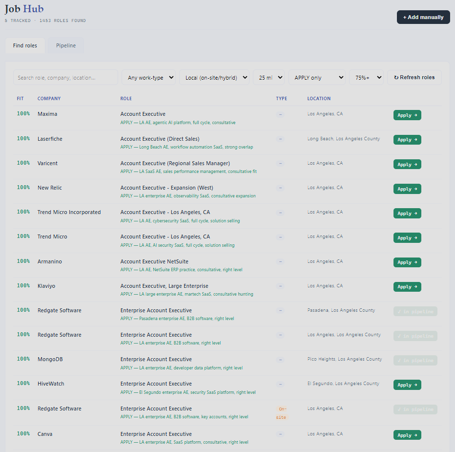
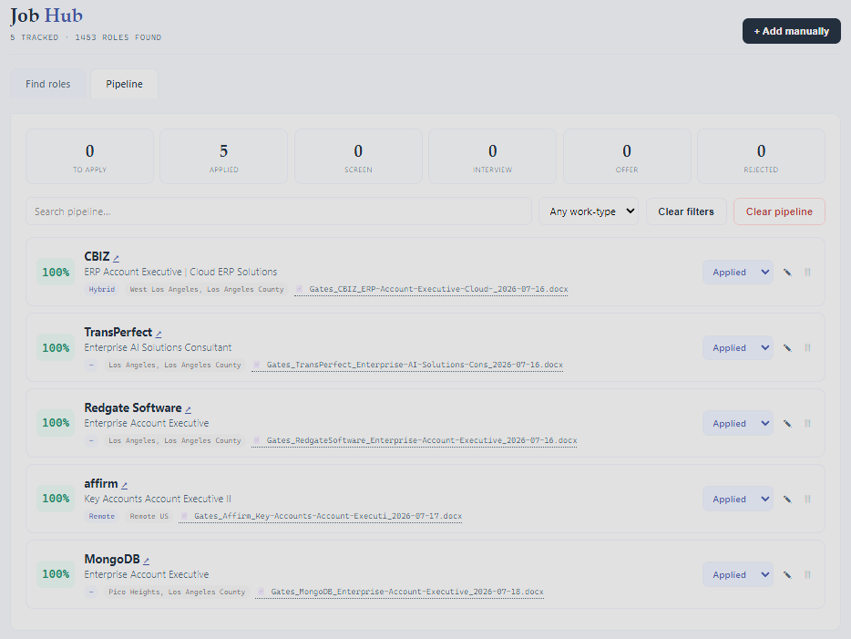

# Job Search Toolkit

**An AI-assisted job search system that finds roles across the whole market, scores them against your resume, uses Claude to triage them with real judgment, and tailors your resume per application — while preserving your formatting.**

Built by [Matthew Gates](https://www.linkedin.com/in/matthewjgates) to solve a problem in my own job search: the market is full of postings that don't exist, don't fit, or don't pay. Applying at volume only works if you can separate signal from noise fast.

Runs entirely on your machine. No accounts, no server, no data leaves your computer.



*1,453 roles pulled from four APIs and dozens of company boards — filtered to within 25 miles, 75%+ keyword fit, and only the ones Claude judged worth applying to. Each row carries its verdict and the reasoning behind it.*

---

## The problem

Modern job searching has three bottlenecks, and only one of them is "finding jobs":

| Bottleneck | Reality |
|---|---|
| **Coverage** | Company career pages show one employer at a time. Aggregators like LinkedIn block automation. |
| **Relevance** | Keyword matching says "100% fit" on roles you'd never take. Volume without judgment is just noise. |
| **Throughput** | Tailoring a resume per application is the right move — and the reason most people stop doing it by application #10. |

This toolkit attacks all three.

---

## What it does

### 1. Finds roles across the whole market
Pulls from **four job APIs** (Adzuna, Jooble, JSearch/Google Jobs, USAJobs) plus **public ATS boards** (Greenhouse, Lever, Ashby) for any companies you list. Filters to your commute radius or remote-US at pull time, so irrelevant roles never enter your list.

### 2. Triages with actual judgment
Keyword scoring is a blunt instrument — it can't tell an Enterprise AE role from an SDR job that happens to share vocabulary. So the toolkit exports job descriptions in batches, you run them through a Claude Project, and it returns `APPLY / MAYBE / SKIP` with a reason. Verdicts import back and become a filter.

> In my own use, Claude marked **~75% of keyword-"perfect" matches as SKIP** — wrong level, wrong vertical, commission-only, or territory-locked elsewhere. That's the gap between a keyword score and a real decision.

### 3. Tailors resumes without destroying formatting
Most resume tools rebuild your document from plain text and wreck your layout. This one edits the actual `.docx` at the XML level — it detects your experience sections automatically, **replaces** the bullets you choose with tailored versions, and preserves every font, color, and column of your original design.

### 4. Tracks the pipeline
One-click apply from a found role: picks the right resume variant, copies the filename to save it as, opens the posting, and logs it as Applied. Then track stages (Applied → Screen → Interview → Offer) with follow-up reminders.



*Every application is logged with the exact tailored resume that was sent, so when a recruiter calls three weeks later you know which version they're holding.*

---

## Architecture

```
                  ┌──────────────────────────────────────┐
   4 Job APIs ───▶│                                      │
   (Adzuna,       │            job_hub.py                │
    Jooble,       │   • pulls + dedupes                  │
    JSearch,      │   • scores vs your resume            │──▶ found_roles.json
    USAJobs)      │   • filters by radius / remote-US    │
                  │   • two-tab UI: Find + Pipeline      │──▶ applications.json
   ATS Boards ───▶│                                      │
   (Greenhouse,   └──────────────────────────────────────┘
    Lever, Ashby)                   │
                                    ▼
                  ┌──────────────────────────────────────┐
                  │  export_jds.py  ──▶ batch files      │
                  │        │                             │
                  │        ▼                             │
                  │  [ Claude Project: Job Triage ]      │
                  │        │  APPLY / MAYBE / SKIP       │
                  │        ▼                             │
                  │  import_verdicts.py                  │
                  └──────────────────────────────────────┘
                                    │
                                    ▼
                  ┌──────────────────────────────────────┐
                  │  [ Claude Project: Resume Tailoring ]│
                  │   picks variant, flags red flags,    │
                  │   writes bullets from real history   │
                  │        │                             │
                  │        ▼                             │
                  │  resume_tailor.py + resume_engine.py │
                  │   XML-level bullet replacement,      │
                  │   formatting fully preserved         │──▶ tailored .docx
                  └──────────────────────────────────────┘
```

**Design decisions worth noting:**

- **Local-first.** Everything runs on `localhost`. Your resume and pipeline never leave your machine.
- **Config-driven.** All personal data lives in `config.json`. No code changes needed to use it for a different person, market, or industry.
- **TOS-clean.** Only official APIs and public, no-auth ATS endpoints. No LinkedIn/Indeed scraping.
- **Human-in-the-loop by design.** The tool never invents experience or auto-submits applications. It removes friction around the decision, not the decision itself.

---

## The tools

| File | What it does |
|---|---|
| `setup.py` | One-time setup. Reads your resume, builds `config.json`. |
| `job_hub.py` | Main app. Find roles + track applications. `localhost:8756` |
| `resume_tailor.py` | Paste tailored bullets → replace/add → download formatted `.docx`. `localhost:8757` |
| `resume_engine.py` | Shared library. Detects resume sections, injects/replaces bullets at the XML level. |
| `export_jds.py` | Exports job descriptions in batches for Claude triage. |
| `import_verdicts.py` | Reads Claude's verdicts back into the roles list. |
| `diagnose.py` | Health check: which APIs and company boards are working. |
| `expand_companies.py` | Verifies company slugs, prunes dead ones, adds new verified ones. |

Prompts for the two Claude Projects live in [`prompts/`](prompts/).

---

## Getting started

**Requires:** Python 3.10+ (no pip installs — standard library only)

```bash
git clone https://github.com/YOURNAME/job-search-toolkit.git
cd job-search-toolkit

# put your resume in this folder as master.docx, then:
python setup.py
```

Setup asks for your name, target role keywords, and resume variants, then writes `config.json`.

**Add API keys** (all optional — the toolkit works with just ATS boards, but the APIs are where the volume is):

| API | Cost | Where |
|---|---|---|
| Adzuna | Free | [developer.adzuna.com](https://developer.adzuna.com) |
| USAJobs | Free | [developer.usajobs.gov](https://developer.usajobs.gov) |
| Jooble | Free | [jooble.org/api/about](https://jooble.org/api/about) |
| JSearch | ~$25/mo | [RapidAPI](https://rapidapi.com) |

Paste them into `config.json`, then:

```bash
python diagnose.py     # confirm everything's wired up
python job_hub.py      # opens localhost:8756 — hit "Refresh roles"
```

Full workflow in [`docs/WORKFLOW.md`](docs/WORKFLOW.md).

---

## Using it for a different job search

Nothing is hardcoded to me. To adapt it:

1. Drop in your own `master.docx`
2. Run `setup.py` — it reads *your* resume for scoring keywords
3. Edit `config.json`: `target_roles` (your titles), `companies` (your industry's employers), `location_filter` (your commute)
4. Swap the city list in `job_hub.py` (`LA_CITY_BANDS`) for your metro

The Claude Project prompts in `prompts/` contain a work history — replace it with yours.

---

## Limitations

Stated plainly, because they're real:

- **The keyword fit score is not judgment.** It measures vocabulary overlap. That's why the Claude triage step exists — treat the percentage as a sorting aid, not a verdict.
- **ATS coverage is partial.** Only Greenhouse, Lever, and Ashby have usable public endpoints. Companies on Workday, iCIMS, or Taleo are invisible to the board search (though the APIs often catch their postings anyway).
- **Company slugs go stale.** Employers migrate ATS platforms constantly. `expand_companies.py` exists to prune the dead ones.
- **Resume parsing expects standard layouts.** Heading-styled job titles with bulleted lists. Heavily table-based or image-based resumes may not parse.
- **The city radius is estimated.** Distance bands are geographic approximations, not routing-API accurate.
- **It won't fill out applications for you.** That's deliberate. Auto-submitted applications are how you get auto-rejected.

---

## License

MIT — see [LICENSE](LICENSE).

---

*Built with [Claude](https://claude.ai).*
